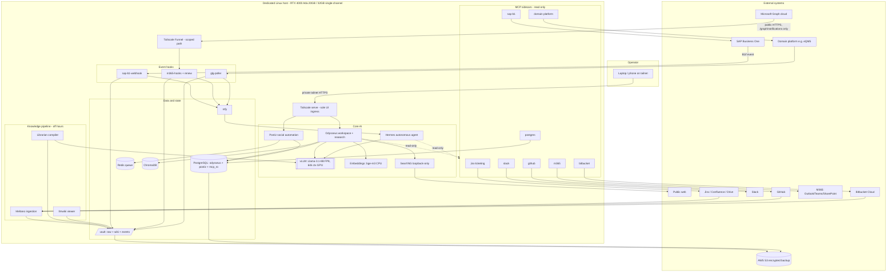

# Private Local AI Server — Project Specification, Architecture & Implementation Plan

**Status:** Draft for review
**Audience:** Project owner / reviewer
**Scope of this document:** the complete design as built across four Docker Compose layers, the rationale behind the key decisions, a system block diagram, and a phased rollout plan with acceptance criteria.

> Reviewer note: items that depend on fast-moving third-party tools or on credentials/IDs only you can supply are collected in **§9 Open Items**. Everything marked there needs your confirmation before or during the relevant phase.

---

## 1. Project Specification

### 1.1 Objective

Build a high-performance, **private-first** AI server on a single dedicated Linux host that functions as (a) an autonomous AI workspace and deep-research platform, (b) a social-media scheduling/automation hub, (c) an enterprise knowledge compiler ("LLM wiki"), and (d) a live, read-only context bridge to enterprise systems. The system must operate entirely locally or over an encrypted private mesh, using public cloud only for encrypted off-site backup.

### 1.2 In scope

- Local LLM serving and embeddings on the workstation GPU.
- Self-hosted workspace (Odysseus), private meta-search (SearXNG), autonomous orchestration (Hermes), social automation (Postiz).
- Automated enterprise data ingestion and a nightly "Librarian" wiki compiler.
- Read-only MCP context bridges to: PostgreSQL, GitHub, Slack, Bitbucket Cloud, SAP Business One, Microsoft 365 (Outlook/Teams/SharePoint), and an enterprise domain-specific platform (reference implementation: a regulated eQMS).
- Event hooks from SAP B1 (via B1if), Microsoft Graph (change notifications), and an enterprise domain-specific platform (polling).
- Encrypted, database-safe backup to AWS S3.
- Single-gateway secure remote access via Tailscale.
- System monitoring/observability (metrics dashboard, GPU stats, live logs).
- Configurable GPU scaling: single-node default, single-host multi-GPU and multi-node (Ray) supported.

### 1.3 Out of scope / explicit non-goals

- Public internet exposure of any application UI (the only public surface is a single Microsoft Graph notification path — see §3.4).
- Multi-node / HA clustering. This is a single-host design.
- Write access from AI agents into systems of record (all enterprise connectors are **read-only**; the only writes are Postiz publishing to social platforms the user authorizes).
- Configuration of third-party systems themselves (e.g. building the SAP B1if scenario, registering the Azure AD app). The stack provides the receiving/consuming end; the sending side is configured by you in those systems.

### 1.4 Functional requirements

| ID | Requirement |
|----|-------------|
| F-1 | Serve a primary instruct LLM and an embedding model locally on the GPU. |
| F-2 | Provide a self-hosted chat/agent/research workspace usable from the operator's devices over the private mesh. |
| F-3 | Provide private meta-search as the research backend, never exposed publicly. |
| F-4 | Run an autonomous agent capable of scheduled, multi-step, tool-using tasks against the local model. |
| F-5 | Schedule and publish social-media content with a persistent job queue. |
| F-6 | Ingest enterprise data (Jira, Confluence, Slack, Google Drive, GitHub, Bitbucket, SAP B1) into a local staging vault on a schedule. |
| F-7 | Nightly, compile staged data into an interlinked Markdown wiki (dedupe, backlinks, contradiction flags), segregated per project. |
| F-8 | Expose read-only, real-time context from enterprise systems to the orchestrators via MCP. |
| F-9 | Receive/derive near-real-time events from SAP B1, Microsoft 365, and an enterprise domain-specific platform. |
| F-10 | Back up all persistent state to encrypted S3 on a schedule, database-safe, with guaranteed service resumption. |

### 1.5 Non-functional requirements

| ID | Requirement | Target |
|----|-------------|--------|
| N-1 (Performance) | Primary model + embeddings + working context resident in GPU VRAM. | ~14 GB of 20 GB used; ≥6 GB headroom. |
| N-2 (Performance) | Host must not thrash the single-channel RAM. | Per-service memory limits; models pinned in VRAM; ingestion/compile confined to off-hours. |
| N-3 (Security) | No public inbound ports for application UIs. | Tailscale is the sole ingress; one scoped Funnel exception for Graph notifications. |
| N-4 (Security) | Enterprise connectors cannot mutate systems of record. | Read-only at two layers (server mode + credential scope). |
| N-5 (Privacy) | No enterprise data leaves the host except encrypted backups and explicitly-authorized social posts. | Local models; egress limited to required services. |
| N-6 (Resilience) | Services restart automatically and depend on healthy dependencies. | `restart: unless-stopped` + healthchecks + `depends_on` conditions. |
| N-7 (Resilience) | Backups are crash-consistent and never leave a DB frozen. | Pause→snapshot→unpause with a guaranteed-unpause trap. |
| N-8 (Data integrity) | Off-site backups support immutability. | Restic + S3 Object Lock handling. |

### 1.6 Hardware & platform constraints

- **CPU:** Intel Core i7-14700 (20 cores / 28 threads).
- **GPU:** NVIDIA RTX 4000 Ada, 20 GB GDDR6 ECC (Ada = FP8-capable).
- **RAM:** 32 GB, **1×32 GB single-channel** DDR5-5200 — memory *bandwidth* is the binding constraint, not capacity.
- **Storage:** 1 TB Gen4 NVMe.
- **OS:** Ubuntu Server 24.04 LTS.

---

## 2. Component Inventory

The stack is delivered as a **base layer** plus a **knowledge layer**. The knowledge layer is physically split into **function-specific overlay files** for granular bring-up, but functionally it is one layer: ingest enterprise data, compile it into the wiki, and expose live read-only context and event hooks. Section 2 is organised by that logical grouping; the **Compose file** column maps each service to its overlay, and the **Default?** column shows which overlays start by default versus on-demand.

**Overlay design philosophy (one function per file).** Each overlay owns a single capability domain and is self-contained: it carries that function's read-only MCP sidecar(s) and any event hooks, references the shared `ai-internal` network as external, and is configured entirely through `.env`. This yields three properties: **clear separation** (you can read, reason about, or disable one function in isolation), **extensibility** (add another provider of the same function — e.g. a second ticketing system — as a sibling service in the same overlay, no other file touched), and **configurability** (default vs on-demand is just which `-f` files you include). Ingestion is the one deliberate exception: it stays centralized in a single ephemeral Meltano container (per design decision D-4), so a new source adds a *tap* to `meltano.yml`, not a new container.

**Bring-up profiles:**
- **Standard:** `base` + `integration` + `knowledgebase` + `repo` + `ticketing` + `collab` + `m365` + `monitoring` (workspace, automation, ingestion/wiki, the always-relevant read-only context sidecars, and observability).
- **On-demand modules** (included only when needed): `erp` (SAP Business One) and `glg` (a domain-specific platform component — see §3.5). Separate overlay files, not part of the standard `up`.
- **Advanced (optional):** `cluster` — multi-node GPU serving via Ray. Not needed for single-node (default) or single-host multi-GPU.

> **Tip:** to avoid typing many `-f` flags, set `COMPOSE_FILE` in `.env` (colon-separated) so a bare `docker compose up -d` brings up the standard set:
> `COMPOSE_FILE=docker-compose.yml:docker-compose.integration.yml:docker-compose.knowledgebase.yml:docker-compose.repo.yml:docker-compose.ticketing.yml:docker-compose.collab.yml:docker-compose.m365.yml:docker-compose.monitoring.yml`
> Append `:docker-compose.erp.yml` / `:docker-compose.glg.yml` / `:docker-compose.cluster.yml` (or pass with `-f`) when those are needed.

### 2.1 Base layer — `docker-compose.yml`

Inference is served by **vLLM** (see §3.2) rather than Ollama, for higher concurrent throughput and native FP8 on the Ada GPU; embeddings are served separately so they don't compete for the LLM's VRAM.

| Service | Image / source | Purpose | Internal endpoint | Ingress |
|---------|----------------|---------|-------------------|---------|
| vllm | `vllm/vllm-openai` | Primary LLM serving (FP8, 64k ctx), GPU passthrough, OpenAI-compatible API; **model + parallelism configurable** (single-node default, multi-GPU/multi-node ready) | `vllm:8000` | none |
| embeddings | `michaelf34/infinity` | Embedding model serving (`bge-m3`), OpenAI-compatible | `embeddings:7997` | none |
| chromadb | `chromadb/chroma` | Vector store for Odysseus memory | `chromadb:8000` | none |
| searxng | `searxng/searxng` | Private meta-search (JSON API) | `searxng:8080` | `127.0.0.1` only |
| postgres | `postgres:16` (+ optional `pgvector`) | Shared DB (odysseus + postiz) + `mcp_ro` read-only role | `postgres:5432` | none |
| redis | `redis:7` | Postiz job queue | `redis:6379` | none |
| ntfy | `binwiederhier/ntfy` | Notification bus | `ntfy:80` | none |
| odysseus | built from `pewdiepie-archdaemon/odysseus` | Workspace / deep research UI | `odysseus:7000` | via Tailscale |
| hermes | built (Nous Research installer) | Autonomous orchestration | local daemon | none |
| postiz | `gitroomhq/postiz-app:v2.11.3` | Social automation | `postiz:5000` | via Tailscale |
| tailscale | `tailscale/tailscale` | **Sole ingress** (serve/funnel) | — | tailnet |

### 2.2 Knowledge layer — split into function-specific overlays

One logical layer covering ingestion, wiki compilation, read-only MCP context, and event hooks. Grouped here by function; delivered across the overlay files shown in the **Compose file** column.

**Ingestion & wiki compilation** — `integration` + `knowledgebase`

| Service | Image / source | Purpose | Transport / lifecycle | Compose file |
|---------|----------------|---------|-----------------------|--------------|
| meltano | built (`meltano/meltano`) | Singer-based ingestion → vault | cron (ephemeral) | integration |
| wiki-viewer | built (llmwiki + opencode) | Browse compiled wiki | HTTP 3000, always-on | knowledgebase |
| wiki-compiler ("Librarian") | same image | Nightly wiki compile via local model | cron (ephemeral) | knowledgebase |

**Read-only MCP context sidecars**

| Service | Image / source | Purpose | Transport | Compose file | Default? |
|---------|----------------|---------|-----------|--------------|----------|
| mcp-postgres | `crystaldba/postgres-mcp` | DB schema/query context (restricted) | SSE 8000 | integration | ✅ |
| mcp-github | `github/github-mcp-server` + supergateway | Repo/PR/commit (read-only, lockdown) | SSE 8081 | repo | ✅ |
| mcp-bitbucket | `ibrahimogod/bitbucket-mcp` (Cloud) | Bitbucket **Cloud** repo/PR context | HTTP 8080 | repo | ✅ |
| mcp-jira | `sooperset/mcp-atlassian` (Jira-scoped) | Ticketing context (read-only); **extensible** to Linear/ServiceNow/etc. | SSE 9000 | **ticketing** | ✅ |
| mcp-slack | `korotovsky/slack-mcp-server` | Channel/thread context | SSE 13080 | collab | ✅ |
| mcp-m365 | `softeria/ms-365-mcp-server` | Outlook/Teams/SharePoint (Graph), read-only | HTTP 8000 | m365 | ✅ |
| sap-b1-mcp | built (custom) | SAP B1 Service Layer (OData v4), GET-only | streamable-HTTP 8000 | **erp** | ⛔ on-demand |
| mcp-glg | built (custom) | **Enterprise domain-specific platform** (read-only REST), GET-only — reference implementation of the pattern (§3.5) | streamable-HTTP 8000 | **glg** | ⛔ on-demand |

**Event hooks**

| Service | Image / source | Purpose | Mechanism | Compose file | Default? |
|---------|----------------|---------|-----------|--------------|----------|
| m365-hooks | built (custom) | Graph change-notification receiver + auto-renew | HTTP 8810 (public via Funnel) | m365 | ✅ |
| sap-b1-webhook | built (custom) | Receiver for SAP B1if event hooks | HTTP 8800 (B1if push) | **erp** | ⛔ on-demand |
| glg-poller | built (custom) | Domain-specific platform change detection | polling loop (private) | **glg** | ⛔ on-demand |

**Platform & observability overlays**

| Service | Image / source | Purpose | Exposure | Compose file | Default? |
|---------|----------------|---------|----------|--------------|----------|
| beszel | `henrygd/beszel` | Metrics dashboard (history, alerts) | `127.0.0.1:8090` | monitoring | ✅ |
| beszel-agent | `henrygd/beszel-agent` | Host + Docker + **GPU** metrics collector | internal | monitoring | ✅ |
| dozzle | `amir20/dozzle` | Live in-browser container log viewer | `127.0.0.1:8089` | monitoring | ✅ |
| vllm *(override)* | — | Multi-node Ray backend toggle for the base `vllm` service | Ray dashboard `127.0.0.1:8265` | cluster | ⚙️ advanced |

---

## 3. Architecture Description

### 3.1 Layering principle

The system is built as a stable **core** (local AI + workspace + automation + data) with **integration overlays** stacked on top. Overlays are independently deployable and testable, and add either ingestion, MCP read-context, or event hooks. Removing an overlay never breaks the core. Two overlays — **`erp` (SAP B1)** and **`glg` (an enterprise domain-specific platform)** — are **on-demand**: they are not part of the standard bring-up and start only when their `-f` file is explicitly included, since those external systems aren't always needed.

### 3.2 Compute & model strategy

The inference engine is **vLLM** (replacing the original Ollama choice) for two reasons specific to this hardware and workload: the RTX 4000 Ada is **FP8-capable**, and vLLM's PagedAttention + continuous batching give markedly better throughput under concurrent load (Odysseus + Hermes + the nightly Librarian can all hit the model at once). vLLM serves an OpenAI-compatible API on `:8000`; embeddings are served separately by an Infinity container (`bge-m3`) so they don't contend for the LLM's VRAM.

The defining constraint is unchanged: **Hermes rejects any model offering fewer than 64,000 tokens of context.** vLLM satisfies it with `--max-model-len 65536`, and an **FP8 weight checkpoint + FP8 KV cache** keep the 64k window inside the VRAM budget:

| Item | VRAM |
|------|------|
| `Llama-3.1-8B-Instruct` weights (FP8) | ~8.0 GB |
| 64k KV cache (FP8) | ~4 GB |
| vLLM runtime / CUDA graphs overhead | ~1.5 GB |
| **LLM total (GPU)** | **~13.5 GB** |
| `bge-m3` embeddings | **on CPU** (≈0 GB VRAM) |

`--gpu-memory-utilization 0.82` caps vLLM's allocation at ~16.4 GB, leaving headroom; embeddings run on the CPU by default (the 20-core CPU handles `bge-m3` comfortably) to keep maximum VRAM available for context. The throughput headroom from vLLM also opens the option of a larger model, but a 14B at FP8 cannot hold 64k on 20 GB, so the **8B FP8 model stays the pick** for the Hermes requirement — vLLM's gain here is concurrency and KV efficiency, not a bigger model.

> **Migration note:** moving from Ollama to vLLM changes how clients reference the model — they now point at `http://vllm:8000/v1` with served-model-name `llama3.1-8b` (Odysseus `LLM_HOST`, Hermes `base_url`, the Librarian `OPENAI_BASE_URL`), and embeddings move to `http://embeddings:7997`. These wiring changes are already applied in the compose files.

**Model is configurable (Llama default, Qwen supported).** The served model is set by `VLLM_MODEL` / `VLLM_SERVED_NAME` in `.env`; everything downstream references the served name. The **default is Llama-3.1-8B-Instruct (FP8)** specifically because its native context is 128k, so Hermes's 64k requirement is met with no rope-scaling. **Qwen is fully supported** and is a strong alternative for agentic/multilingual work — the recommended fit for this 20 GB GPU at 64k is **Qwen2.5-7B-Instruct (FP8)** or **Qwen3-8B (FP8)**. The one caveat: Qwen's native context is 32k, so reaching 64k requires enabling **YaRN rope-scaling** via `VLLM_EXTRA_ARGS` (a ready-to-use line is in `.env.example`). 14B-class models do not fit a 64k window on 20 GB, so this appliance stays at the ~7–8B tier regardless of family.

**Scaling — single node by default, multi-GPU/multi-node ready.** The inference engine is parameterized so growth is a config change, not a redesign:
- **Single node, 1 GPU (default):** `VLLM_TENSOR_PARALLEL_SIZE=1`, `VLLM_GPU_COUNT=1`.
- **Single host, N GPUs:** set `VLLM_TENSOR_PARALLEL_SIZE=N` and `VLLM_GPU_COUNT=N`. vLLM uses the multiprocessing backend — no Ray needed.
- **Multi-node (across hosts):** include `docker-compose.cluster.yml` (flips vLLM to the Ray backend), set `VLLM_TENSOR_PARALLEL_SIZE` = GPUs/node and `VLLM_PIPELINE_PARALLEL_SIZE` = number of nodes (TP × PP = total GPUs), and start worker hosts with vLLM's bundled `run_cluster.sh`. All nodes share the same image, model, and LAN; tensor parallelism prefers a fast interconnect (InfiniBand/100 GbE). Compose is single-host, so it configures *this* node; the workers are joined with the helper script — documented in the cluster overlay header.

### 3.3 Data architecture

- **PostgreSQL** runs once, partitioned into `odysseus` and `postiz` databases with separate least-privilege roles, plus a dedicated **read-only** `mcp_ro` role for the Postgres MCP.
- **Redis** is dedicated to the Postiz queue (AOF on, so scheduled jobs survive restarts).
- **ChromaDB** backs Odysseus's vector memory.
- **The vault** (`/data/vault`) is the knowledge substrate: `raw/<source>/` (ingested staging) → `wiki/<project>/` (compiled, Obsidian-compatible). Event hooks also land under `raw/<source>/events/`.
- **All persistent state** lives under a single bind-mounted tree (`${DATA_ROOT}`), which is the unit of backup.

### 3.4 Network & security architecture

- One internal bridge network, `ai-internal`. **No application UI publishes a host port.**
- **Tailscale is the sole ingress.** It TLS-terminates and reverse-proxies Odysseus and Postiz over the private tailnet via `tailscale serve`.
- **SearXNG** binds to `127.0.0.1` only and is reachable internally; it has web egress because meta-search inherently queries the public web.
- **Egress is intentionally open** for the services that require it (search, model pulls, social publishing, backups, enterprise APIs). The security model is *inbound* isolation, not outbound.
- **The one public exception:** Microsoft Graph delivers change notifications from Microsoft's cloud, so the `m365-hooks` receiver must be public HTTPS. This is exposed via **Tailscale Funnel scoped to the single `/graph/notifications` path**; safety rests on the Graph validation handshake plus a `clientState` shared secret, not on obscurity. SAP B1if posts from the SAP host (on the LAN/tailnet) and the domain-specific platform uses outbound polling, so neither needs public ingress.
- **Read-only enforcement is layered:** connector servers run in read-only/restricted mode *and* are given read-scoped credentials (e.g. the `mcp_ro` DB role, a read-only SAP user, scoped API tokens). The GET-only custom bridges (SAP B1, the domain-specific platform) are structurally incapable of writing.
- **Secrets** live in a single `.env` (never committed); backups are encrypted by Restic and pushed to an Object-Lock-capable S3 bucket.
- **Remote shell access uses Tailscale SSH on the host, not the container.** The `tailscale` container runs in userspace mode (`TS_USERSPACE=true`) purely to `serve`/`funnel` the app endpoints; it has no TUN device and no route into the host, so it cannot provide a shell. Management access is instead a *separate* tailnet node: Tailscale installed natively on the Ubuntu host with `tailscale up --ssh --hostname=cucoon-host --advertise-tags=tag:server`. SSH is then gated by tailnet identity + an ACL `ssh` rule (`dst: ["tag:server"]`), with no public `:22` — preserving the "Tailscale is the sole ingress" invariant. The host node and the app-serving container node coexist on the tailnet under distinct hostnames. See README → *Remote shell access (Tailscale SSH)* for the exact commands and ACL snippet.

### 3.5 Integration architecture

- **Ingestion (pull, scheduled):** Meltano runs Singer taps in the off-hours window, writing JSONL into the vault. Chosen over Airbyte because Airbyte's always-on footprint (4+ vCPU / 8 GB RAM) is incompatible with this single-channel host; Meltano is ephemeral (<512 MB per run).
- **Knowledge compilation (nightly):** `llmwiki` is an **MCP server** (it exposes wiki tools), so a driver is required — the "Librarian" is a headless `opencode` agent using the local model, run at 02:00, compiling per project to prevent cross-department context bleed. Quality is model-bound; the nightly job can be pointed at a stronger endpoint without affecting the rest of the stack.
- **Live context (read, on-demand):** MCP sidecars expose read-only context to Odysseus and Hermes over the internal network. Reference servers that were deprecated were replaced with current maintained equivalents; the stdio-only GitHub server is bridged to SSE via supergateway.
- **Event hooks (push/derived):** SAP B1 (Service Layer has no webhooks → B1if Event Sender posts to a receiver), Microsoft Graph (subscriptions with auto-renew → public receiver via Funnel), and an enterprise domain-specific platform (no documented webhooks → private polling). This last is a reusable **pattern** — a read-only REST MCP plus a polling change-detector — for any domain-specific enterprise SaaS that lacks webhooks; the shipped `glg` overlay is its reference implementation.

### 3.6 Resilience & lifecycle

Every long-running service uses `restart: unless-stopped`, a healthcheck, and dependency conditions so it only starts behind healthy dependencies. Batch services (`meltano`, `wiki-compiler`) use Compose profiles so they stay dormant until cron invokes them. The backup script pauses the stateful containers, snapshots the vault, and uses a shell trap to **guarantee unpause** on any exit path.

---

## 4. Block Diagram



*Read-only relationships are dashed. Solid arrows are data/control flow. The only public-internet inbound path is `Microsoft Graph cloud → Tailscale Funnel → m365-hooks`; everything else enters via the private tailnet or is outbound.*

---

## 5. Implementation Plan

The plan is phased so each capability is validated before the next is layered on. Each phase lists prerequisites, key steps, and acceptance criteria.

### Phase 0 — Host preparation
**Prereqs:** clean Ubuntu 24.04, sudo access.
**Steps:** install NVIDIA driver + Container Toolkit; configure Docker GPU runtime; set `vm.swappiness=10`; create `${DATA_ROOT}`; clone the Odysseus repo into `./odysseus`; copy `.env.example` → `.env` and generate all secrets.
**Acceptance:** `docker run --rm --gpus all ubuntu nvidia-smi` lists the RTX 4000 Ada.

### Phase 1 — Core workspace + research
**Prereqs:** Phase 0; a Tailscale auth key and tailnet name; a Hugging Face token (`HF_TOKEN`) if the FP8 checkpoint requires it.
**Steps:** bring up the base compose (vLLM downloads the FP8 model on first run; the Infinity embeddings container loads `bge-m3` on CPU); confirm Tailscale serve routes; first-login to Odysseus, add the OpenAI-compatible provider pointing at `http://vllm:8000/v1` (model `llama3.1-8b`), and enable the trusted-proxy HTTPS setting.
**Acceptance:** `vllm` and `embeddings` healthchecks pass; Odysseus reachable at `https://<host>.<tailnet>.ts.net`; a chat completes against the local model; a research query returns SearXNG-sourced results; `nvidia-smi` shows ~13–14 GB used with ≥5 GB headroom.

### Phase 2 — Automation (Postiz + Hermes)
**Prereqs:** Phase 1 healthy.
**Steps:** verify Postiz over Tailscale `:8443`, create the admin user, connect at least one social account; confirm Hermes starts against the 64k-context local model and runs a trivial scheduled task.
**Acceptance:** a scheduled Postiz post fires; a Hermes scheduled task runs end-to-end against the local model.

### Phase 3 — Backup & recovery
**Prereqs:** Phases 1–2; S3 bucket (versioning + Object Lock) and IAM credentials.
**Steps:** populate Restic/AWS values in `.env`; run `backup.sh` manually; perform a **test restore** into a scratch directory; install the cron entry.
**Acceptance:** snapshot appears in S3; restore reproduces the vault and DB volumes; containers are confirmed unpaused after the run (including a simulated mid-run failure).

### Phase 4 — Knowledge layer (ingestion, wiki, repo/DB/collab MCP)
**Prereqs:** Phase 1; source credentials (Jira/Confluence/Slack/Drive/GitHub/**Bitbucket Cloud**); read-only `mcp_ro` role applied; (for M365) the Azure AD app registration.
**Steps:** bring up the **standard** set — `base + integration + knowledgebase + repo + ticketing + collab + m365` (set `COMPOSE_FILE` in `.env`, then `docker compose up -d`); build the Meltano image; run one ingestion job per source; run the Librarian compile once manually; verify the wiki viewer; wire the postgres/github/**bitbucket**/**jira**/slack/m365 MCP endpoints into Odysseus and Hermes; configure the M365 Funnel path + subscriptions; install the nightly cron.
**Acceptance:** `raw/<source>/` populates; `wiki/<project>/` produces interlinked pages with backlinks and contradiction tags; each always-on MCP returns read-only results to an agent; a test M365 change produces a `clientState`-verified notification; ingestion/compile run only in the off-hours window.

### Phase 5 — ERP module (SAP B1) — **on-demand**
**Prereqs:** Phase 4; SAP B1 Service Layer URL + **read-only** SAP user; (for hooks) a B1if environment.
**Steps:** include the on-demand overlay (`… -f docker-compose.erp.yml up -d`); build the SAP B1 bridge image; bring up `sap-b1-mcp` and confirm read-only queries; bring up `sap-b1-webhook` and expose it to the SAP host over the tailnet; configure the B1if Event Sender → HttpCall to the receiver; add the SAP extractor to the nightly ingest.
**Acceptance:** agents read SAP B1 entities read-only; a B1 object change produces a stored event in the vault; nightly SAP extract writes JSONL. Confirm the module is **absent** from a standard `up` (only present when its `-f` file is included).

### Phase 6 — Domain-specific platform module — **on-demand**
**Prereqs:** Phase 4; the platform's read-only API key; confirmed API base URL/paths/auth.
**Steps:** include the on-demand overlay (`… -f docker-compose.glg.yml up -d`); build the bridge; set the base URL/paths/auth from the platform's API reference; bring up `mcp-glg` + `glg-poller`.
**Acceptance:** agents read the platform's records read-only; a record change is detected by the poller and stored; module absent from a standard `up`.

### Phase 7 — Hardening & operations
**Prereqs:** Phases 1–6.
**Steps:** validate the monitoring overlay (Beszel dashboard, GPU metrics via the agent, Dozzle live logs); document the runbook (start/stop, restore, secret rotation, model swap); confirm `DISABLE_REGISTRATION=true` on Postiz after admin creation; review all connector credential scopes; full backup/restore drill.
**Acceptance:** VRAM headroom stays ≥ ~5 GB under load; documented restore completes within target; no service publishes a `0.0.0.0` port except via Tailscale/Funnel.

---

## 6. Key Design Decisions (rationale & tradeoffs)

| # | Decision | Why |
|---|----------|-----|
| D-1 | 64k context via vLLM `--max-model-len 65536` + FP8 KV cache | Hermes requires ≥64k; FP8 weights + FP8 KV cache fit it in the budget (~13.5 GB) with headroom. |
| D-2 | Postiz pinned to v2.11.3 | Avoids the Temporal dependency (extra always-on service) introduced in v2.12+, on a RAM-constrained host. |
| D-3 | Shared Postgres for Odysseus, SQLite fallback | One engine, clean partitioning; Odysseus is a new release, so a documented SQLite fallback de-risks PG migration. |
| D-4 | Meltano instead of Airbyte | Airbyte's 8 GB always-on footprint is incompatible with single-channel 32 GB; Meltano is ephemeral. |
| D-5 | Librarian = opencode driver over llmwiki MCP | llmwiki is an MCP *server*, not a batch script; it needs an agent to drive compilation. |
| D-6 | Current MCP servers, not the archived reference ones | The named `server-postgres`/`server-slack` are deprecated; maintained equivalents are used. |
| D-7 | SSE/stdio transport handled explicitly (supergateway for GitHub) | Networked sidecars need network transport; the official GitHub server is stdio-only. |
| D-8 | Two-layer read-only enforcement | Server mode + credential scope; GET-only custom bridges for SAP and the domain-platform bridge. |
| D-9 | Tailscale Funnel only for Graph notifications | Microsoft's cloud must reach a public endpoint; everything else stays private. |
| D-10 | Domain-platform hooks via polling | The platform has no documented webhooks; polling keeps it fully private. |
| D-11 | Single-channel RAM mitigations throughout | Per-service mem limits, VRAM-pinned model, off-hours batch, bounded KV pool. |
| D-12 | **vLLM as the inference engine** (replacing Ollama) | Ada is FP8-capable; PagedAttention + continuous batching give far better concurrency for multi-agent load. Embeddings moved to a separate Infinity container (CPU) so they don't contend for LLM VRAM. |
| D-13 | **ERP (SAP) and the domain-specific platform as on-demand overlays** | They aren't always needed, so they start only when their `-f` file is included; everything else is standard. |
| D-14 | **One function per overlay file** (integration / knowledgebase / repo / ticketing / collab / m365 / erp / glg) | Clear separation, easy enable/disable, and extensibility — a new provider of an existing function (e.g. another ticketing system) is a sibling service in that overlay, nothing else changes. Ingestion is the deliberate exception: it stays one ephemeral Meltano container, so new sources are *taps*, not containers. |
| D-15 | **Parameterized inference: single-node default, multi-GPU/multi-node ready** | `VLLM_*` env knobs (model, served-name, TP/PP sizes, GPU count, extra args) make scaling a config change. Single-host multi-GPU uses multiprocessing; cross-host uses the optional `cluster` overlay + Ray. Model is swappable (Llama default; Qwen supported with YaRN for 64k). |
| D-16 | **Monitoring as its own standard overlay** (Beszel + Dozzle) | Lightweight, private-first observability (metrics dashboard + GPU stats + live logs) that fits the single-channel-RAM budget; matters more because vLLM pre-allocates its KV pool. |

### 6.1 Optional enhancements (recommended; your call)

Adopted into the design above: **vLLM**, **a dedicated embeddings service**, and the **monitoring overlay** (Beszel dashboard + Dozzle logs + GPU metrics — its own overlay now, part of the standard set). The following are recommended but left optional so you decide per your priorities:

| Enhancement | Benefit | Note |
|-------------|---------|------|
| Logical `pg_dump` alongside the volume snapshot | Gold-standard DB-restore correctness | Add to `backup.sh` as a second step; complements the crash-consistent volume snapshot. |
| `pgvector` for the wiki/analytics vectors | One fewer moving part; consolidates vectors into Postgres | Odysseus still *requires* ChromaDB, so this is additive, not a replacement. |
| Qdrant (if vector workloads grow) | Faster, dedicated vector store | Only if ChromaDB becomes a bottleneck. |
| Caddy in front of Tailscale (or Headscale) | Cleaner multi-app routing; Headscale = fully self-hosted control plane | Tailscale `serve` is sufficient today; revisit if app count grows or you want zero external coordination dependency. |
| Stronger nightly model endpoint for the Librarian | Higher-quality wiki synthesis | Isolated to the nightly job; rest of the stack stays local. |

---

## 7. Operational Model

- **Daily:** ~01:00 ingestion (`nightly.sh ingest`), ~02:00 wiki compile (`nightly.sh compile`), ~03:30 backup (`backup.sh`). All heavy/embedding/OCR work is confined to this window to protect the single memory channel during work hours.
- **Continuous:** core services, MCP sidecars, and the M365 and domain-platform hook listeners run always-on but lightweight.
- **On change:** secrets rotated via `.env`; model swaps via `VLLM_MODEL` (+ re-pull on first start) and the served-model-name in the client wiring; connector scopes reviewed when added.

---

## 8. Risks & Mitigations

| Risk | Impact | Mitigation |
|------|--------|------------|
| Single-channel RAM contention | Latency spikes under concurrent load | mem limits; FP8 model resident in VRAM; embeddings on CPU; batch confined to off-hours; bounded vLLM KV pool. |
| Local 8B model limits wiki/synthesis quality | Weaker enterprise wiki | Nightly compile can target a stronger endpoint without de-localizing the rest. |
| vLLM pre-allocates the KV pool | Less obvious VRAM headroom at a glance | `--gpu-memory-utilization 0.82` caps it; monitoring service watches headroom. |
| Third-party tool churn (CLIs/flags/images) | Build breaks on first run | Brittle command strings flagged inline; verify against each tool's current docs (see §9). |
| Graph subscription expiry / Funnel exposure | Missed events / attack surface | Auto-renew at half-life; Funnel scoped to one path; validation + clientState. |
| Odysseus PG migration immaturity | Workspace DB issues | Documented SQLite fallback. |
| S3 Object Lock vs. Restic prune | Prune fails on locked objects | Align retention to lock window or use governance bypass identity (handled in `backup.sh`). |
| Self-signed SAP Service Layer TLS | Verification disabled inside trust boundary | Acceptable on `ai-internal`→LAN; install a real cert and flip `VERIFY_SSL=true` if traffic could traverse less-trusted links. |

---

## 9. Open Items (need your confirmation)

These are the values and external-system configurations only you can supply or verify, plus the fast-moving tool specifics to confirm at build time.

1. **Tailscale:** auth key, tailnet (MagicDNS) name; enable **Funnel** for the Graph path.
2. **AWS S3:** bucket with versioning + Object Lock, IAM credentials, chosen Object Lock mode (governance vs. compliance).
3. **Hermes / opencode / llmwiki:** confirm current CLI verbs/flags at build (`hermes --help`, `opencode --help`, `./llmwiki --help`).
4. **MCP server specifics to verify:** GitHub toolsets; Postgres MCP transport flag; Slack token scheme (XOXP vs browser tokens); Bitbucket Cloud image env names + endpoint path; **Jira MCP** (`sooperset/mcp-atlassian`) — Cloud API token vs Server/DC PAT env names, and confirm Jira-only scoping (omit Confluence creds); M365 server env names + HTTP flags (its `docs/deployment.md`).
5. **SAP Business One:** Service Layer URL, company DB, **read-only** user; whether B1if is available for event hooks; B1if Event Sender filter + HttpCall configuration on the SAP side.
6. **Microsoft 365:** Azure AD app registration; read-only Graph application permissions + admin consent; the real `USER_ID`/`SITE_ID`/`LIST_ID` values for `GRAPH_SUBSCRIPTIONS`; note Teams message notifications need resource-specific consent + the Graph change-notification billing model.
7. **Domain-specific platform:** confirm the API base URL, auth header scheme, resource paths, and the modified-since query parameter from that platform's API reference (often account-gated); read-only API key.
8. **Inference engine (vLLM):** confirm the model + checkpoint (`VLLM_MODEL`; default Llama-3.1-8B FP8, or switch to Qwen2.5-7B / Qwen3-8B FP8 with the YaRN `VLLM_EXTRA_ARGS` line in `.env.example`), a Hugging Face token if gated, `--gpu-memory-utilization` after observing real headroom, and — if scaling — `VLLM_TENSOR_PARALLEL_SIZE` / `VLLM_PIPELINE_PARALLEL_SIZE` / `VLLM_GPU_COUNT` for your GPU topology (Ray + `cluster` overlay for multi-node).
9. **Embeddings:** `bge-m3` on CPU (default, preserves VRAM) vs. GPU if you downsize LLM context; confirm the Infinity CLI flags for your image tag.
10. **Monitoring:** on first run, create the Beszel admin and paste the agent public key into `BESZEL_KEY`; confirm the agent's GPU-metrics enablement env against the Beszel version you pull.

---

## 10. Repository Layout

```
ai-stack/
├── docker-compose.yml                 # base: vLLM + embeddings + workspace + automation
├── docker-compose.integration.yml     # Meltano ingestion + read-only Postgres MCP            [default]
├── docker-compose.knowledgebase.yml   # llmwiki viewer + Librarian compiler                    [default]
├── docker-compose.repo.yml            # GitHub + Bitbucket (Cloud) MCP                          [default]
├── docker-compose.ticketing.yml       # Jira MCP (extensible: Linear/ServiceNow/...)            [default]
├── docker-compose.collab.yml          # Slack MCP                                               [default]
├── docker-compose.m365.yml            # Microsoft 365 (MCP + Graph hooks)                       [default]
├── docker-compose.monitoring.yml      # Beszel dashboard + agent (GPU) + Dozzle logs           [default]
├── docker-compose.erp.yml             # SAP Business One (MCP + B1if hooks)                      [ON-DEMAND]
├── docker-compose.glg.yml             # domain-specific platform, ref. impl. (MCP + poller)    [ON-DEMAND]
├── docker-compose.cluster.yml         # multi-node Ray backend toggle for vLLM                  [ADVANCED]
├── .env                               # all secrets + COMPOSE_FILE (never committed)
├── odysseus/                          # cloned Odysseus repo (build context)
├── searxng/settings.yml
├── postgres/{init-databases.sh, mcp-readonly.sql}
├── tailscale/serve.json               # serve (Odysseus/Postiz) + Funnel (Graph path)
├── hermes/{Dockerfile, config.yaml}   # points at vLLM
├── meltano/{Dockerfile, meltano.yml}  # all ingestion taps (incl. the Jira tap)
├── librarian/{Dockerfile, compile.sh} # opencode driver -> vLLM
├── mcp-github/Dockerfile              # supergateway wrapper (stdio -> SSE)
├── sap-b1/{Dockerfile, server.py, webhook.py, extract.py}
├── m365/{Dockerfile, hooks.py}
├── glg/{Dockerfile, server.py, poll.py}
├── scripts/{backup.sh, nightly.sh}
└── docs/ARCHITECTURE.md               # this document
```

**Bring-up commands:**

```bash
# Recommended: set COMPOSE_FILE in .env (see §2), then simply:
docker compose up -d                       # standard set

# Add the SAP B1 module only when needed:
docker compose -f docker-compose.yml -f docker-compose.integration.yml \
  -f docker-compose.knowledgebase.yml -f docker-compose.repo.yml \
  -f docker-compose.ticketing.yml -f docker-compose.collab.yml \
  -f docker-compose.m365.yml -f docker-compose.erp.yml up -d

# Add the domain-specific platform module only when needed:
#   ...append -f docker-compose.glg.yml to the standard set instead.
```
